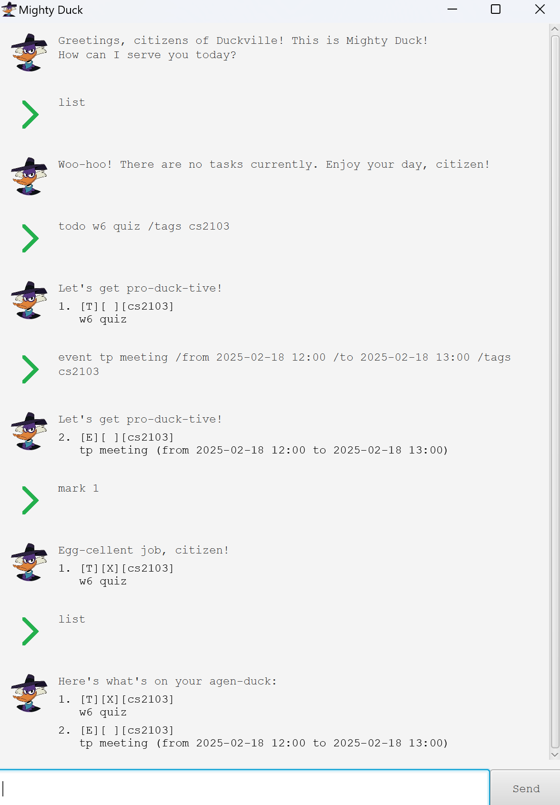

# Mighty Duck User Guide

Mighty Duck is a desktop task management app designed for fast typists. It combines the
efficiency of a Command Line Interface (CLI) with the advantages of a Graphical User Interface
(GUI).

    

## Quick start

1. Ensure you have Java 17 or higher installed on your computer.

2. Download the latest `.jar` file from the
   [release page](https://github.com/quangthangisme/ip/releases/).

3. Move the `.jar` file to the desired home directory for your application.

4. Open the file to launch the application. A GUI should appear within a few seconds.

5. Enter a command in the command box and press Enter or click "Send" to execute it. Refer to the
   Command sections below for detailed information on each command.

## Commands

### 📋 Notes about the command format

- Words enclosed in `<>` represent parameters provided by the user.
- Parameters in square brackets `[ ]` are optional.
- The `...` symbol indicates that multiple parameters of the same type can be provided.
- Parameters must be supplied in the specified order.
- Any extra parameters provided for commands that do not require parameters (e.g., `list` or `bye`)
  will be ignored.
- Additional parameter requirements:
    - Time must be formatted as `YYYY-MM-DD HH:MM`.
    - Tags must be non-numeric, consist of a single string of characters, and contain no spaces.
    - Indices must be positive integers and correspond to valid entries in the task manager.
- The command will **not** be executed if any of the parameters are invalid.

### Viewing help: `help`

Shows a message with a link to access the help page.

Format: `help`

### Adding a to-do: `todo`

Adds a to-do to the manager.

Format: `todo <name> [/tags <tag1> <tag2> ...]`

Examples:

- `todo cleaning`
- `todo homework 2 /tags need-help urgent`

### Adding a deadline: `deadline`

Adds a deadline to the manager.

Format: `deadline <name> /by <time> [/tags <tag1> <tag2> ...]`

Examples:

- `deadline project /by 2025-01-18 12:00`
- `deadline problem set /by 2025-01-18 12:00 /tags school`

### Adding an event: `event`

Adds an event to the manager.

Format: `event <name> /from <time> /to <time> [/tags <tag1> <tag2> ...]`

The start time must be earlier than the end time.

Examples:

- `event course meeting /from 2025-01-18 12:00 /to 2025-01-18 12:30`
- `event training camp /from 2025-01-18 12:00 /to 2025-01-20 12:00 /tags physical`

### Listing all tasks: `list`

Shows a list of all tasks in the manager.

Format: `list`

### Marking tasks as completed: `mark`

Marks the tasks at the specified indices as completed in the manager. The command will fail if
any of the tasks is already marked as completed.

Format: `mark <index1> <index2> ...`

Example:

- `mark 1 3 5`

### Marking tasks as not completed: `mark`

Marks the tasks at the specified indices as not completed in the manager. The command will fail if
any of the tasks is already marked as not completed.

Format: `unmark <index1> <index2> ...`

Example:

- `unmark 1 3 5`

### Tagging tasks: `tag`

Assigns tags to the tasks at the specified indices. The command will fail if any task already has
one of the specified tags.

Format: `tag <index1> <index2> ... <tag1> <tag2> ...`

Example:

- `tag 1 5 6 urgent school-project`

### Removing tags: `untag`

Removes the specified tags from the tasks at the specified indices. The command will fail if any of
the tags are not present in all the tasks.

Format: `untag <index1> <index2> ... <tag1> <tag2> ...`

Example:

- `untag 1 5 6 urgent school-project`

### Locating tasks by name: `find`

Searches for tasks whose names contain any of the specified keywords as substrings.

The search is case-insensitive, so for example, `meow` will match `HomeOwner`.

Format: `find <keyword1> <keyword2> ...`

### Deleting tasks: `delete`

Deletes the tasks at the specified indices.

Format: `delete <index1> <index2> ...`

Example:

- `delete 1 3 5`

### Exiting the program : `bye`

Exits the program.

Format: `exit`

## Data

Mighty Duck's data is automatically saved to the hard disk after any command that modifies the data.
Manual saving is not required.

Advanced users may choose to update the data directly by editing the data file. However, if the
file's format becomes invalid due to these changes, Mighty Duck will discard all data and start with
an empty file upon the next launch. Therefore, it is recommended to back up the file before making
any edits.
